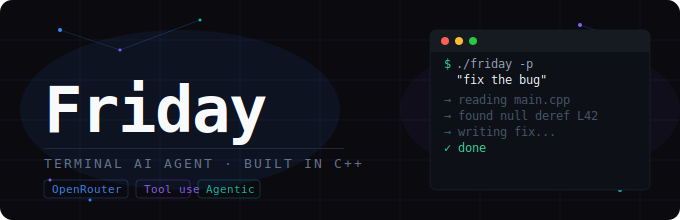

<p align="center">
  
</p>

# Friday

> *A terminal-based AI coding agent built from scratch in C++. Give it a prompt, and it figures out the rest.*

```bash
./friday -p "Read main.cpp, find the bug, and fix it"
```

---

## What is Friday?

Friday is a lightweight agentic AI assistant that lives in your terminal. Powered by large language models via OpenRouter, it autonomously reads files, writes code, and executes shell commands by looping until your task is complete.

No GUI. No bloat. Just a prompt and results.

---

## How It Works

```
You give Friday a prompt
        ↓
Friday thinks about what tools it needs
        ↓
It reads files, runs commands, writes code
        ↓
It checks its own work and iterates
        ↓
Done. Task complete.
```

Friday implements a full **agentic tool-use loop** — the same pattern behind products like Claude Code, Devin, and GitHub Copilot Workspace — built entirely in C++ from first principles.

---

## Features

- **Read** — reads any file and reasons about its contents
- **Write** — creates or modifies files autonomously
- **Bash** — executes shell commands and processes their output
- **Agentic loop** — keeps going until the job is done, not just one response
- **OpenRouter powered** — plug in any supported LLM, including free-tier models
- **Zero dependencies beyond C++** — just `cpr` and `nlohmann/json`

---

## Getting Started

### Prerequisites

- CMake 3.15+
- vcpkg
- A C++17 compiler
- An [OpenRouter](https://openrouter.ai) API key (free tier works)

### Build

```bash
git clone https://github.com/Hardattsinh-Zala/friday.git
cd friday
cmake -B build
cmake --build build
```
Or
```bash
git clone https://github.com/Hardattsinh-Zala/friday.git
cd friday
./start.sh
```

### Configure

```bash
export OPENROUTER_API_KEY=your_key_here
export OPENROUTER_BASE_URL=https://openrouter.ai/api/v1/chat/completions
```

### Run

```bash
./friday.sh -p "Your task here"
```

---

## Examples

```bash
# Understand a codebase
./friday.sh -p "Read main.cpp and explain what this program does"

# Fix a bug
./friday.sh -p "Read utils.cpp, find the memory leak, and fix it"

# Write something new
./friday.sh -p "Create a Python script that scrapes HackerNews headlines"

# Refactor
./friday.sh -p "Read all .cpp files and refactor them to follow RAII principles"

# Use any free model
./friday.sh -p "Summarize README.md in 3 bullet points"
```

---

## Free Models

Friday works with any OpenRouter model. These free-tier models work great:

| Model | Best For |
|-------|----------|
| `meta-llama/llama-3.3-70b-instruct:free` | General tasks, tool use |
| `deepseek/deepseek-r1:free` | Reasoning, debugging |
| `openrouter/free` | Auto-selects best available free model |

Change the model in `main.cpp`:

```cpp
{"model", "meta-llama/llama-3.3-70b-instruct:free"},
```

---

## Architecture

Friday is intentionally simple. The entire agent loop is ~200 lines of C++:

```
main.cpp
├── HTTP request to OpenRouter (via cpr)
├── Tool dispatch loop
│   ├── Read  → reads file, returns contents to model
│   ├── Write → writes file from model output
│   └── Bash  → runs shell command, returns stdout to model
└── Loop until model returns a final text response
```

No frameworks. No abstractions. Just the raw agentic pattern.

---

## Roadmap

- [ ] Streaming output (see responses as they generate)
- [ ] Multi-file context (pass entire directories)
- [ ] Config file support (`friday.config.json`)
- [ ] Conversation history (multi-turn sessions)
- [ ] Web search tool
- [ ] Token usage tracking

---

## License

MIT — use it, fork it, build on it.

---

## Inspiration

Built as a ground-up exploration of how agentic AI coding assistants actually work under the hood. If tools like Claude Code feel like magic, Friday is the curtain pull.

---

*Named after Tony Stark's AI assistant. Because why not.*